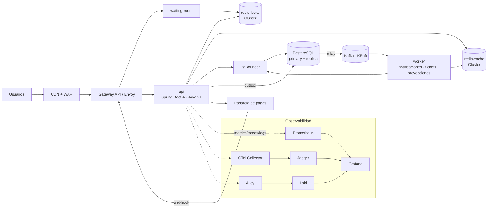

# Backlog Técnico Detallado: Plataforma de Tickets

> **Versión:** 3.0 (auditada sobre v2.0) · **Fecha:** 2026-10-03 · **Estado:** Lista para ejecución por hitos
> **Objetivo del proyecto:** construir una plataforma de venta de entradas de alta concurrencia, llevarla a producción y, en el camino, aprender a operar de punta a punta cada tecnología del stack.

Toda la documentación, especificaciones técnicas y evolución de estos requerimientos deben centralizarse en Confluence para mantener un repositorio organizado y accesible para todo el equipo. Este archivo es la fuente de verdad en formato *docs-as-code* (vive en el repo bajo `/docs`) y se sincroniza a Confluence (ver sección 0.8).

### Cómo leer este documento

- Se **respeta la estructura original**: Épica → Historia de Usuario (HU) con *Descripción*, *Tareas de Implementación*, *Criterios de Aceptación (CA)* y *Casos de Uso* (*Happy Path* / *Failure Path*).
- Cada HU lleva una etiqueta de origen:
  - `[ORIGINAL · AMPLIADA]` — existía en el plan; se corrigió y expandió. Incluye un bloque **Hallazgos de la auditoría** que explica qué se cambió y por qué.
  - `[NUEVA]` — no existía; se agrega para cubrir un hueco detectado.
- Las épicas **01 a 05** conservan su numeración original. Las épicas **06 a 12** son nuevas. La **épica 13** (Catálogo y Administración) se implementa después de la 03 pero conserva el número 13 para no invalidar las referencias `NN.N` ya escritas en el resto del documento.
- El backend de referencia es **Spring Boot 4.x sobre Java 21** (hilos virtuales) con **Spring JDBC + Flyway, sin ORM** (ADR-012). Donde el patrón difiere en Go, se indica el equivalente.
- Cada HU declara su **nivel de rigor**: `demostración` (funcional en local o *staging*, con evidencia) o `producción` (cumple el Definition of Done completo de §0.8). El plan de ejecución está en §0.9.
- Los fragmentos de código son **material de referencia** para arrancar: validá versiones y sintaxis contra la documentación vigente antes de copiarlos tal cual.

---

## Índice

0. [Auditoría del plan original](#0-auditoría-del-plan-original)
1. [Épica 01: Infraestructura Base, DevOps & CI/CD](#épica-01-infraestructura-base-devops--cicd)
2. [Épica 02: Autenticación, Usuarios y Seguridad](#épica-02-autenticación-usuarios-y-seguridad)
3. [Épica 03: Modelo de Datos, Persistencia e Índices](#épica-03-modelo-de-datos-persistencia-e-índices)
3. [Épica 13: Catálogo y Administración](#épica-13-catálogo-y-administración) — *se implementa aquí; numeración 13 por estabilidad de referencias*
4. [Épica 04: Motor de Reserva Atómica & Alta Concurrencia](#épica-04-motor-de-reserva-atómica--alta-concurrencia)
5. [Épica 05: Capa de Caching y Resiliencia](#épica-05-capa-de-caching-y-resiliencia)
6. [Épica 06: Órdenes, Pagos e Idempotencia](#épica-06-órdenes-pagos-e-idempotencia)
7. [Épica 07: Event Streaming con Kafka](#épica-07-event-streaming-con-kafka)
8. [Épica 08: Kubernetes y Plataforma de Runtime](#épica-08-kubernetes-y-plataforma-de-runtime)
9. [Épica 09: Observabilidad (Métricas y Trazas)](#épica-09-observabilidad-métricas-y-trazas)
10. [Épica 10: Logging Centralizado](#épica-10-logging-centralizado)
11. [Épica 11: Testing de Carga con k6](#épica-11-testing-de-carga-con-k6)
12. [Épica 12: Seguridad, Operación y Go-Live](#épica-12-seguridad-operación-y-go-live)
13. [Anexos](#anexos)

> Secciones internas de §0: [0.9 Plan de ejecución por hitos](#09-plan-de-ejecución-por-hitos) · [0.10 Fuera de alcance](#010-fuera-de-alcance)

---

## 0. Auditoría del plan original

### 0.1 Resumen ejecutivo

El plan original tiene **buenas intuiciones técnicas** (bloqueo atómico con `SET NX EX`, índice con `INCLUDE` para *index-only scans*, *optimistic locking*, *token bucket*, *singleflight*, historial inmutable de precios). Sin embargo, frente al objetivo declarado —*aprender todo el stack llevándolo a producción*— tiene cuatro problemas de fondo:

1. **Cobertura incompleta del stack.** De las 10 capas del cuadro objetivo, solo 5 tienen HU. Faltan por completo: Kafka, Kubernetes (más allá de menciones), PgBouncer, Observabilidad (métricas/trazas), Logging centralizado y k6.
2. **Falta el corazón del negocio.** No hay flujo de checkout, pagos, idempotencia, expiración de reservas ni emisión de tickets. Sin eso, el "motor de reserva" no cierra el ciclo de venta.
3. **Algunas afirmaciones técnicas son imprecisas o incorrectas** (p. ej. que el *optimistic locking* previene *Write Skew*; que un *singleflight* en memoria garantiza una sola consulta con múltiples pods; que un *rate limiter* puede lograr que los rechazos "no consuman recursos").
4. **Distancia entre "funciona en mi máquina" y "producción".** No hay SLOs, backups, DR, runbooks, gestión de secretos, seguridad de la cadena de suministro ni *production readiness review*.

Este documento corrige lo primero, completa lo segundo, rectifica lo tercero y agrega lo cuarto.

### 0.1 bis Resumen de la segunda auditoría (v2.0 → v3.0)

La v2.0 es sólida **como documento**, pero al auditarla **como sistema** aparecen cuatro tipos de problema que la primera auditoría no cubría:

1. **Defectos de correctitud en el camino de compra.** El *hold* rápido ignora los asientos `BLOCKED`; el precio no queda congelado entre el *hold* y la orden; la expiración del *hold* en Redis y la de la orden en la DB están calibradas al mismo instante, dejando una ventana en la que un asiento aparece libre y ya no es; el reembolso no define qué pasa con `seats.status` ni con `order_items.released_at`; y la alerta que supuestamente vigila la sobreventa no puede detectar sobreventa.
2. **Código de referencia que no funciona tal como está escrito.** `hold_many.lua` devuelve el TTL en lugar del `seatId`, nunca escribe en el `ZSET` de retenciones y ni siquiera lo incluye en `KEYS`; el `SecurityFilterChain` deja el flujo de *refresh* inaccesible; `confirmSale` omite la condición que su propia tarea exige; los parámetros de Argon2id no coinciden con los que el texto exige.
3. **Huecos de alcance.** No existe cliente (decidido **fuera de alcance**, ADR-015), no existe catálogo ni administración (épica 13: sin `venues`, sin carga de asientos, sin ciclo de vida del evento, el sistema no se puede sembrar ni operar) y no existe CDN/WAF en la IaC pese a que el diagrama los exige.
4. **El plan no es ejecutable por una persona a tiempo parcial.** 50 HUs con el Definition of Done completo son ~600 h. La v3.0 introduce §0.9 con **3 hitos, nivel de rigor por HU y estimaciones** para que el alcance sea una decisión visible y no una sorpresa.

Los 42 hallazgos están en §0.3 y cada uno tiene su acción asignada en la HU correspondiente.

### 0.2 Cobertura del stack objetivo: antes vs. después

| Capa | Tecnología objetivo | Plan original | Plan v2.0 |
|---|---|---|---|
| Backend Core | Go o Spring Boot (Java 21) | Mencionado, sin HU de arquitectura ni decisión | ADR-001, HU 02.x, 04.x, 05.x, 06.x |
| Transactional DB | PostgreSQL + PgBouncer | PostgreSQL parcial; **PgBouncer ausente** | HU 03.1–03.3 (PgBouncer en 03.3) |
| Cache & Lock | Redis Cluster | Solo lock simple; **sin Cluster**, sin separación cache/lock | HU 04.1, 04.3–04.5, 05.1–05.3 |
| Event Streaming | Apache Kafka | Solo en docker-compose; **sin HU** | Épica 07 completa (outbox, DLQ, schema registry) |
| Container/Orch | Docker & Kubernetes | Docker compose; K8s solo como mención | HU 01.1, Épica 08 completa |
| IaC & CI/CD | Terraform + GitHub Actions + ArgoCD | Básico, sin seguridad ni entornos | HU 01.2–01.4, 08.4 |
| Observabilidad | Prometheus + Grafana + OpenTelemetry (Jaeger) | **Ausente** | Épica 09 completa |
| Logging centralizado | Loki + Promtail/Fluent Bit (o ELK) | **Ausente** | Épica 10 completa (Promtail → Alloy) |
| Testing de carga | k6 | **Ausente** | Épica 11 completa |
| Producción | (objetivo declarado) | **Ausente** | Épica 12 completa |

> **Capas deliberadamente fuera del alcance** (ADR-015, §0.10): cliente web/móvil, aplicación de escáner de puerta, notificaciones SMS/push, multi-moneda, impuestos y comisiones, multi-tenant, reventa y transferencia de entradas. El "usuario" de las pruebas de carga es el script de k6 y el proveedor de pagos es un simulador.

### 0.3 Hallazgos de la auditoría

Severidad: **Crítico** (bloquea el objetivo o puede causar pérdida de dinero/datos), **Alto** (riesgo técnico serio), **Medio** (mejora relevante), **Bajo** (higiene).

| ID | Sev. | HU | Hallazgo | Acción en v2.0 |
|---|---|---|---|---|
| A-01 | Crítico | — | No existe checkout, pago, idempotencia ni emisión de tickets. | Épica 06 |
| A-02 | Crítico | 04.1 | Lock Redis sin token de propiedad: un `DEL` ciego puede liberar el lock de otro usuario. Además, Redis replica de forma **asíncrona**: un failover puede perder el lock y dos usuarios creerse dueños del mismo asiento. | Token único + liberación con Lua; la **DB es el árbitro final** (HU 04.2) |
| A-03 | Alto | 04.2 | El CA afirma que el *optimistic locking* "previene estrictamente el *Write Skew*". Es incorrecto: previene *lost updates* sobre la misma fila. *Write Skew* involucra filas distintas y requiere `SERIALIZABLE` o restricciones. | CA reescrito; `UPDATE` condicional por estado + índice único parcial como última defensa |
| A-04 | Alto | — | Kafka está en el stack y en el compose, pero sin una sola HU. | Épica 07 |
| A-05 | Alto | — | K8s, Observabilidad, Logging y k6 sin HU, aunque son requisito explícito. | Épicas 08–11 |
| A-06 | Alto | 05.1 | *Singleflight*/`synchronized` es **por proceso**: con N pods hay hasta N consultas, no 1. Un `synchronized` global además serializa claves distintas. | L1 con coalescing por clave + L2 Redis + lock distribuido + *stale-while-revalidate* |
| A-07 | Alto | 04.1/05 | Cache y locks en el mismo Redis con política de *eviction*: con `maxmemory` alcanzado Redis puede **evictar locks** (tienen TTL). | Dos clusters: `redis-locks` (`noeviction`, AOF) y `redis-cache` (`allkeys-lru`) |
| A-08 | Alto | 03.2 | El índice no incluye `id`; la consulta del mapa necesita `id` para reservar → habría *heap fetches* y no sería *index-only*. Además depende del *visibility map* (autovacuum). El CA de <10 ms es irreal para un estadio completo (50k filas). | `INCLUDE (id, seat_row, seat_column)`, tuning de autovacuum, CA por sección; mapa completo servido desde Redis/CDN (HU 04.6) |
| A-09 | Alto | — | PgBouncer figura en el stack y no tiene HU. El *transaction pooling* rompe prepared statements antiguos, advisory locks de sesión y `SET`. | HU 03.3 |
| A-10 | Alto | 01.3 | El pipeline solo compila y corre JUnit: sin escaneo de dependencias/imágenes, sin firma, sin SBOM, sin `gitleaks`, sin estrategia de migraciones. | HU 01.3 y 01.4 ampliadas |
| A-11 | Alto | 01.2 | Terraform sin *state locking*, sin separación de entornos, sin credenciales efímeras (OIDC) y sin análisis estático. El "estado contaminado (*tainted*)" del *failure path* es impreciso: un error de cuota **no** deja el recurso en el estado. | HU 01.2 reescrita |
| A-12 | Medio | 05.2 | *Rate limiting* solo por IP (NAT y botnets lo vuelven ineficaz); el estado debe ser global (Redis); "los rechazos no consumen recursos" es inalcanzable literalmente. | Límites por IP + usuario + endpoint, Lua atómico, CA reformulados |
| A-13 | Medio | 02.2 | Bloquear la IP por >5 intentos castiga redes compartidas y no frena ataques distribuidos; el bloqueo duro por cuenta es un vector de DoS. | Backoff progresivo por cuenta + IP, sin bloqueo permanente |
| A-14 | Medio | 02.2 | JWT sin algoritmo, rotación de claves, `kid`/JWKS ni estrategia de refresh/revocación. | HU 02.2 y 02.3 |
| A-15 | Medio | 02.1 | No define parámetros de Argon2id/BCrypt ni política de contraseñas; el hashing es CPU-intensivo (riesgo de DoS en picos). | Parámetros OWASP, NIST 800-63B, *bulkhead* para hashing |
| A-16 | Medio | 02.1 | `409 Conflict` en registro permite enumerar emails. | Se mantiene por UX con mitigaciones; ADR-006 |
| A-17 | Medio | 03.1 | Faltan `users`, `payments`, `tickets`, `outbox_events`, `idempotency_keys`. Dinero sin tipo definido. Inmutabilidad de `price_paid` solo "por convención". | DDL completo, dinero en unidades menores, *trigger* de inmutabilidad |
| A-18 | Medio | 01.1 | El compose carece de PgBouncer, *healthchecks*, Kafka en modo KRaft, perfil de observabilidad y paridad con Redis Cluster. "<2 minutos" ignora el tiempo de descarga de imágenes. | HU 01.1 reescrita |
| A-19 | Medio | 01.3 | "Rolling Update sin downtime" requiere *readiness probes*, *graceful shutdown*, `maxUnavailable: 0` y `PodDisruptionBudget`; no está especificado. | HU 01.3 y 08.2 |
| A-20 | Medio | — | Sin *waiting room*/control de admisión, el pico viral (objetivo de k6) satura todo el sistema aguas abajo. | HU 04.3 |
| A-21 | Medio | — | No hay expiración de órdenes ni reconciliación Redis↔DB. Las *keyspace notifications* de Redis no son confiables para esto. | HU 04.5 |
| A-22 | Medio | — | **Tecnología desactualizada**: Promtail llegó a EOL el 2-mar-2026 (reemplazo: Grafana Alloy o Fluent Bit); `ingress-nginx` fue retirado en marzo de 2026 (reemplazo: Gateway API); Kafka ya no requiere ZooKeeper (KRaft). | Stack actualizado (ADR-007, ADR-008) |
| A-23 | Medio | 05.x | Título "Resiliencia" sin *circuit breakers*, *timeouts*, *bulkheads* ni *load shedding*. | HU 05.4 |
| A-24 | Medio | — | Sin estrategia de configuración y secretos. | HU 01.4 |
| A-25 | Medio | — | Sin backups, DR, runbooks, seguridad perimetral ni *readiness review*. | Épica 12 |
| A-26 | Bajo | — | Sin DoD global, NFRs, SLOs, modelo de capacidad ni ADRs. | Secciones 0.5, 0.7, 0.8 |
| A-27 | Bajo | — | Residuos de copia (`[cite: 4]`) en el texto original. | Eliminados |
| A-28 | Bajo | — | "Go o Spring Boot" sin decisión. | ADR-001 |
| A-29 | Medio | 05.1 | *Failure path* del líder con *timeout*: si todos los esperadores reintentan a la vez se genera una tormenta de reintentos. | *Backoff* con *jitter*, *stale-on-error*, *circuit breaker* |

### 0.3 bis Hallazgos de la segunda auditoría (sobre el plan v2.0)

Severidad con el mismo criterio de §0.3. La columna final indica la HU donde se aplica la corrección.

#### Críticos — permiten comportamiento incorrecto o pérdida de dinero

| ID | Sev. | HU | Hallazgo | Corrección en v3.0 |
|---|---|---|---|---|
| B-01 | Crítico | 04.1 | El *hold* rápido solo consulta `sold:{evt:sec}`. El enum incluye `BLOCKED`, así que un asiento bloqueado se puede retener y pagar; `confirmSale` exige `status='AVAILABLE'` y falla tarde, con reembolso. | `unavailable:{evt:sec}` = SOLD ∪ BLOCKED, consultado por el mismo Lua |
| B-02 | Crítico | 04.1 | El precio se lee al crear la orden, no al retener. Si el organizador cambia `price_tiers` entre ambas, el usuario ve un importe y paga otro. | El *hold* congela el precio (`holdprice:{evt}:{sec}`); la orden lo toma de ahí |
| B-03 | Crítico | 04.5/06.1 | `expires_at` = vencimiento del *hold*, así que el *hold* desaparece de Redis exactamente cuando la orden sigue `PENDING_PAYMENT`. En esa ventana la UI muestra el asiento libre y otro usuario lo retiene; el índice único rechaza su orden con 409 **después** de una reserva exitoso. | `expires_at` = TTL del *hold* − 90 s de margen; CA específico de la ventana |
| B-04 | Crítico | 06.3 | El reembolso no define el efecto sobre `seats.status` ni sobre `order_items.released_at`. Si deja el asiento `SOLD` sin ítem activo, la verificación de sobreventa da falsos positivos; si lo deja `AVAILABLE` con ítem activo, el índice único lo deja impagable para siempre. | ADR-016 define la semántica; CA explícito |
| B-05 | Crítico | 09.4 | La alerta de invariante ejecuta `GROUP BY seat_id HAVING count(*) > 1` sobre `order_items`, lo cual **no puede devolver filas** mientras exista `ux_order_items_active_seat`. Valida que el índice esté, no que no haya sobreventa. | Se alerta sobre la verificación real: SOLD ↔ ítem activo, y orden `PAID` con asiento no `SOLD` |
| B-06 | Crítico | 04.3 | El token de admisión es un JWT sin `aud` propio: o lo acepta el `api` como access token (*confused deputy*), o lo rechaza al validar `aud`. El diseño no cierra. | `aud=waiting-room`, clave de firma propia y validación explícita en el endpoint de *hold* |

#### Altos

| ID | Sev. | HU | Hallazgo | Corrección en v3.0 |
|---|---|---|---|---|
| B-07 | Alto | 04.4 | `hold_many.lua` devuelve `ARGV[1+i]` (el TTL) en lugar del `seatId` en el segundo retorno; nunca hace el `ZADD` que la tarea promete; y `KEYS` no incluye el ZSET, así que no podría. | Lua reescrito y verificado clave por clave |
| B-08 | Alto | 02.2 | `/api/auth/refresh` (sin el prefijo `/api/v1` que exige B-39) no está en `permitAll`, así que con el access token expirado devuelve 401: el flujo de refresh no funciona. Además `csrf().ignoringRequestMatchers("/api/**")` desactiva CSRF en toda la API mientras se introduce un endpoint con cookie. | Refresh en `permitAll`; CSRF ignorado solo donde no hay cookie, con justificación explícita |
| B-09 | Alto | 04.2 | La tarea 2 exige `AND version = :v`; el código de referencia no lo incluye. | ADR-012 descarta la columna `version` del camino de confirmación (el estado es la condición); tarea y código alineados |
| B-10 | Alto | 02.1 | `Argon2PasswordEncoder.defaultsForSpringSecurity_v5_8()` usa 16 MiB, pero la tarea exige los ~19 MiB de OWASP. | Parámetros explícitos en el código, alineados con OWASP |
| B-11 | Alto | — | No hay cliente. Todas las UX del plan (mapa, sala de espera, ticket, escáner) no tienen HU ni tecnología. | Declarado **fuera de alcance** (ADR-015); el usuario de las pruebas es k6 |
| B-12 | Alto | 03.1/13 | No hay HU de catálogo: `venues` no tiene DDL, no hay CRUD de `events`/`price_tiers`, la carga masiva de asientos se da por existente y no hay transición a `SOLD_OUT`. El sistema no se puede sembrar ni operar. | **Épica 13** |
| B-13 | Alto | 01.2 | El diagrama y HU 12.2 exigen CDN + WAF, pero `infra/modules/` no tiene ese módulo ni los certificados de borde. | Módulo `edge/` en Terraform (WAF, CDN, certificados) |
| B-14 | Alto | 04.6/07.4 | El `availability-projector` debe alimentar **todos** los pods por SSE, pero Kafka reparte por partición. Con `concurrency` menor al número de particiones hay pods que no ven todos los deltas. | ADR-017: bus de fan-out en Redis Pub/Sub sobre un único consumidor agregado |
| B-15 | Alto | 04.1/05.3 | No se decide dónde viven `sold:*` y `holds:*`. En `redis-cache` (`allkeys-lru`) se puede perder "vendido" del camino rápido; en `redis-locks` (`noeviction`) no hay límite de memoria. | ADR-013: `redis-locks`, dimensionado, con alerta al 70 % |
| B-16 | Alto | 07.4/08.3 | `worker` es un único despliegue con 4 consumidores sobre 5 tópicos, pero hay un solo `ScaledObject` observando `orders.events`; el *lag* de los otros tópicos no escala y `maxReplicaCount: 12` choca con las 24 particiones de `seats.events`. | Un `ScaledObject` por consumidor, `maxReplicaCount` atado a las particiones de cada tópico |
| B-17 | Alto | 03.x/04.2 | No hay decisión de persistencia: `@Version` (JPA) y `JdbcTemplate` conviven en el mismo plan. | ADR-012: Spring JDBC + Flyway, sin ORM |
| B-18 | Alto | 05.2 | El filtro de *rate limit* debe ir primero, "antes de autenticar", pero se keyea por **usuario autenticado**: imposible. | Orden real documentado: borde → autenticación (ligera) → rate limit por usuario → rate limit por IP |
| B-19 | Alto | 08.2/09.1 | `management.server.port: 8081` pero las tres sondas del `Deployment` apuntan a 8080. | Sondas al puerto de gestión, con nota de por qué |
| B-20 | Alto | 09.1 | CA "el p99 coincide ±5 % con la medición de k6": no alcanzable (poblaciones distintas, la red no la ve el servidor). | CA reformulado a "mismo orden de magnitud (±25 %) y mismo ranking de rutas" |
| B-21 | Alto | 11.1 | `http_req_failed: ['rate<0.01']` (1 %) contradice el CA "< 0.1 %". | `rate<0.001` |
| B-22 | Alto | 11.3 | CA "un PR que degrada el p99 de `hold` > 20 % falla", pero en CI solo corre *smoke*: no hay carga suficiente para detectar eso. | El gate de regresión usa un perfil `load` corto (5 min) en *staging*; el PR sigue con *smoke* |
| B-23 | Alto | 11.2 | La "prueba de la prueba" (desactivar el índice único) no detecta nada usando solo el endpoint de *hold*: ese camino nunca toca `order_items`. | La inyección del fallo se hace sobre el escenario de flujo completo hasta `PAID` |
| B-24 | Alto | 07.1 | `KafkaNodePool` con `roles: [controller, broker]` combinado no es la configuración que Strimzi recomienda para producción. | Pools separados de *controllers* y *brokers*; nota sobre la versión de Strimzi |
| B-25 | Alto | 05.3 | `min-replicas-to-write 1` no existe en ElastiCache con *cluster mode enabled*; solo en Redis autogestionado. | Marcado como exclusivo de Redis autogestionado, con la alternativa gestionada |
| B-26 | Medio | 08.2 | `requests.memory = limits.memory` **sin límite de CPU** deja el pod en QoS `Burstable`, no `Guaranteed`; el comentario sugiere lo contrario. | Comentario corregido y opción de CPU request = limit documentada |
| B-27 | Medio | 08.1/10.1 | `JAVA_TOOL_OPTIONS` hace que la JVM imprima `Picked up JAVA_TOOL_OPTIONS:` en stderr: una línea no-JSON que rompe el CA de "100 % de las líneas son JSON válido". | Flags en el `ENTRYPOINT` en forma exec |

#### Medios

| ID | Sev. | HU | Hallazgo | Corrección en v3.0 |
|---|---|---|---|---|
| B-28 | Medio | 04.5 | La reconciliación usa `SELECT id FROM seats WHERE status='SOLD'`, pero `idx_seats_event_status (event_id, status)` no sirve un filtro solo por `status`: *seq scan* de toda la tabla. | Índice parcial `(event_id, id) WHERE status='SOLD'` y reconciliación por evento |
| B-29 | Medio | 04.3 | La cola de la sala de espera usa **un único slot** por evento, lo que serializa los 200 000 usuarios, contra el principio que el propio plan aplica a los asientos. | Particionado en K sub-colas desde el diseño, no como mitigación posterior |
| B-30 | Medio | 07.1 | `seats.events` con clave `eventId:section` concentra en una partición cuando la sección es grande; el documento razona el riesgo de partición caliente solo para `eventId`. | ADR-017: clave por `seatId` o `eventId:shard<K>` |
| B-31 | Medio | 07.1/07.4 | "Reconstruible reprocesando desde el *offset* 0" es falso con retenciones de 3–7 días para datos más viejos. | Tópico de archivo de larga retención para reconstrucciones, o alcance explícito de la reproyección |
| B-32 | Bajo | 05.2 | `PEXPIRE` recibe `math.ceil(...)` (flotante en Lua 5.1) y hay división por cero si `rate = 0`. | `math.floor`, guarda de `rate > 0` |
| B-33 | Medio | — | Las HUs **02.3, 02.4 y 07.4** no están asignadas a ninguna fase de la hoja de ruta. | Asignadas en §0.9 |
| B-34 | Medio | — | La hoja de ruta justifica llegar temprano con la observabilidad ("k6 sin métricas enseña poco") y la coloca en la Fase 4, después de las fases más difíciles de depurar. | 09.1 y 10.1 pasan a la Fase 1 |
| B-35 | Alto | — | 50 HUs con el DoD completo son ~600 h: no es ejecutable a tiempo parcial y el Anexo C ya marca "alcance demasiado amplio" como riesgo de probabilidad alta, sin mitigarlo. | §0.9: 3 hitos, nivel de rigor por HU, estimaciones y lista de diferidos |
| B-36 | Medio | — | Los ADR-001…011 no tienen dueño ni tarea que los produzca, pero la PRR los exige. | Tarea explícita en §0.8 y en la HU 12.4 |
| B-37 | Medio | 02.3/02.4 | `refresh_tokens`, `audit_log` y `processed_events` se describen sin DDL ni migración asignada, y `venues` ni siquiera aparece en el listado de migraciones de HU 03.1. | Todas las tablas con DDL y migración asignada |
| B-38 | Bajo | 04.1/04.2 | `version` queda muerta (el `UPDATE` va por estado) y la respuesta declara `holdId`/`expiresAt` mientras el código y k6 usan `token`. | Nomenclatura única y columna `version` documentada o eliminada |
| B-39 | Medio | 02.1/06.1 | No hay versionado de API ni pruebas de contrato, aunque el plan define OpenAPI y un sobre de eventos. | Versionado en la ruta y tests de contrato en CI |
| B-40 | Bajo | 09.3/09.4 | El PromQL de SLI y de alertas no filtra por `job`/`application`: si dos servicios comparten la plantilla de URI, la ratio los mezcla. | Selector `application="api"` en todas las queries |
| B-41 | Bajo | 03.1 | `price_minor bigint` asume 2 decimales (JPY y KWD no) y no hay modelo de impuestos ni comisiones. | Resuelto por ADR-015: una moneda, sin impuestos, supuesto de 2 decimales documentado |
| B-42 | Bajo | — | Los archivos `01.md`…`07.md` no corresponden a su contenido y `02.md`–`07.md` no tienen índice. | Índice al inicio de cada archivo |

### 0.4 Qué cambia en la estructura

- Épicas 01–05: **mismas HU, mismos campos**, con CA/tareas corregidos y bloque de hallazgos. Se agregan HU nuevas al final de cada épica (01.4, 02.3, 02.4, 03.3, 04.3–04.6, 05.3, 05.4).
- Épicas 06–12: nuevas, con idéntico formato.
- **Épica 13 (Catálogo y Administración):** nueva, con 3 HUs. Cierra el hueco detectado en B-12: sin ella el sistema no se puede sembrar ni operar.
- Cada HU nueva tiene CA **medibles** (número, umbral o comando verificable) y un *Failure Path* explícito.
- En v3.0 cada HU declara además su **nivel de rigor** (`demostración` / `producción`) y el **ADR del que depende**, para que §0.9 pueda ordenarlas.

### 0.5 Decisiones de arquitectura (resumen de ADRs)

Cada fila debe convertirse en una página ADR en Confluence (plantilla: contexto, decisión, alternativas, consecuencias).

| ADR | Decisión | Alternativa descartada / nota |
|---|---|---|
| ADR-001 | **Spring Boot 4.x + Java 21 + hilos virtuales** como backend de referencia. | Go: excelente a baja huella de memoria y con `singleflight` nativo; el documento incluye equivalentes. Elegir uno y no mezclar en la primera iteración. |
| ADR-002 | **Modular monolith + 3 desplegables**: `api` (identidad, catálogo, inventario, órdenes), `waiting-room` (cola virtual, escala independiente) y `worker` (consumidores Kafka, *outbox relay*, proyecciones). | Microservicios por dominio desde el día 1: sobrecosto operativo sin beneficio inicial. |
| ADR-003 | **AWS** como cloud de referencia (EKS, RDS, ElastiCache, S3). | GKE/GCP equivalentes; los módulos Terraform se parametrizan. |
| ADR-004 | **Dos clusters Redis** (`redis-locks`, `redis-cache`). | Un solo Redis: riesgo de *eviction* de locks (A-07). |
| ADR-005 | **Outbox con *polling*** en v1; **Debezium (CDC)** en v2. | Doble escritura DB+Kafka: pierde consistencia. |
| ADR-006 | **Auth propio** (aprendizaje) con interfaz compatible con OIDC; 409 en registro + *rate limit*. | Keycloak/Auth0 en producción real es una opción legítima. |
| ADR-007 | **Gateway API** (p. ej. Envoy Gateway o Traefik) como entrada al cluster. | `ingress-nginx` retirado en marzo de 2026. |
| ADR-008 | **Loki + Grafana Alloy** (o Fluent Bit) para logs. | Promtail EOL; ELK si se necesita búsqueda full-text pesada (mayor costo). |
| ADR-009 | **OpenTelemetry → Collector → Jaeger**. | Grafana Tempo si se prefiere un backend único de Grafana. |
| ADR-010 | **Pasarela de pagos detrás de un puerto/adaptador** (Mercado Pago o Stripe). | Acoplar el dominio a un SDK concreto. |
| ADR-011 | **Datos persistentes**: PostgreSQL y Redis **gestionados** (RDS/ElastiCache) en producción; Kafka vía **Strimzi** en K8s (para aprender operación). | MSK: más simple pero más caro. Todo dentro de K8s: más riesgo operativo. |

**Decisiones agregadas en la v3.0** (origen: hallazgos B-01…B-42 de §0.3 bis):

| ADR | Decisión | Alternativa descartada / nota |
|---|---|---|
| ADR-012 | **Spring JDBC (`NamedParameterJdbcTemplate`) + Flyway, sin ORM.** El plan ya escribe SQL explícito en HU 03.2, 04.2 y 07.2; un ORM obligaría a elegir entre JPA y lo que el código real hace (B-17). Menos dependencias = menos tiempo a tiempo parcial. | JPA/Hibernate: caché de segundo nivel y *dirty checking* distractores del objetivo (MVCC, locking, planes). `jOOQ` como alternativa si se quiere tipado sin dejar de ver el SQL. |
| ADR-013 | Las claves de disponibilidad y retención (`unavailable:*`, `holds:*`, `holdprice:*`) viven en **`redis-locks`** (`noeviction`), dimensionadas con alerta al 70 % de memoria y reconciliadas desde la DB (B-15, B-01). `redis-cache` queda solo para catálogo y proyecciones. | `redis-cache` (`allkeys-lru`): más barato, pero puede *evictar* "vendido" del camino rápido. La DB seguiría siendo el árbitro (no habría sobreventa), pero el `hold` haría trabajo para un asiento ya vendido y la disponibilidad sería inconsistente. Un tercer cluster es prohibitivo para el presupuesto. |
| ADR-014 | El **webhook solo valida firma, deduplica y responde 200**. Toda la transición de estado ocurre de forma asíncrona vía `payments.events` (B-14, y la ambigüedad síncrono/asíncrono del plan v2.0). | Procesar la confirmación de venta dentro del webhook: simplifica el camino pero hace que el CA de < 500 ms dependa de la transacción de `confirmSale` y de la disponibilidad del *worker*. |
| ADR-015 | **Alcance acotado**: sin cliente web/móvil, sin aplicación de escáner de puerta, sin SMS/push, una sola moneda, sin impuestos ni comisiones, sin multi-tenant, sin reventa ni transferencia. `orders.total_minor = Σ price_paid` (B-11, B-41). | Incluir el cliente agrega una technology stack completa al objetivo de aprendizaje. El usuario de las pruebas de carga es el script de k6 y el proveedor de pagos es un simulador. |
| ADR-016 | **Reembolso** → `seats.status = 'AVAILABLE'`, `order_items.released_at = now()`, `tickets.status = 'VOID'`; el asiento vuelve a venderse (B-04). El evento emite `order.refunded` por *outbox*. | Dejar el asiento `SOLD` (conserva el historial pero quema inventario y da falsos positivos en la verificación de sobreventa) o dejarlo `AVAILABLE` con el ítem activo (el índice único lo deja impagable para siempre). |
| ADR-017 | **Fan-out de deltas**: `seats.events` con clave `seatId` (o `eventId:shard<K>` para repartición) y un único proyector consolidado que publica en **Redis Pub/Sub**, del que cada pod se suscribe para alimentar el SSE (B-14, B-30). | Que cada pod consuma todas las particiones: obliga a `concurrency = particiones` por pod, multiplica el consumo y no escala. |

### 0.6 Arquitectura de referencia



**Flujo crítico (compra):** `waiting-room` admite → `api` valida token de admisión → *hold* en `redis-locks` (≤5 ms) → creación de orden `PENDING_PAYMENT` con `Idempotency-Key` → pago → webhook → `UPDATE` condicional de asientos a `SOLD` + evento `outbox` en una sola transacción → Kafka → emisión de tickets y notificación.

### 0.7 Requisitos no funcionales, SLOs y modelo de capacidad

> Estos números son **hipótesis de diseño**. Se validan con k6 (Épica 11) y se ajustan con datos reales.

| Aspecto | Objetivo |
|---|---|
| Disponibilidad (hold y checkout) | 99.9 % mensual (presupuesto de error ≈ 43 min/mes) |
| Latencia `hold` (extremo a extremo) | p99 < 200 ms |
| Operación de lock en Redis | p99 < 5 ms (medida desde la app, dentro de la VPC) |
| Consulta de disponibilidad por sección (DB) | p99 < 10 ms (≤ 2 000 asientos) |
| Mapa de asientos de un evento completo | servido desde CDN/Redis, p99 < 100 ms |
| Sobreventa | **0 asientos vendidos dos veces** (invariante, no SLO) |
| RPO / RTO de la base de datos | ≤ 5 min / ≤ 1 h |
| Tasa de errores 5xx | < 0.1 % excluyendo 409/429 de negocio |

**Modelo de capacidad (ejemplo de partida):**

- Evento de 50 000 asientos que se agota en ~10 min ⇒ ≈ 83 ventas/s promedio; con picos 5–10× ⇒ **400–800 ventas/s**.
- Cada venta ≈ 1 `INSERT orders` + N `INSERT order_items` + N `UPDATE seats` + 1 `INSERT outbox` ⇒ unas 3–6 escrituras/venta ⇒ **2 400–4 800 escrituras/s** en pico: viable en un primario PostgreSQL bien dimensionado si los *holds* viven en Redis y no en la DB.
- 200 000 usuarios concurrentes en la sala de espera; admisión controlada a la capacidad medida del sistema (HU 04.3), no a la demanda.

### 0.8 Convenciones, Definition of Done y gestión de la documentación

**Definition of Done (aplica a toda HU):**

- [ ] Código revisado por PR y *checks* de CI en verde (build, tests, linters, escaneos).
- [ ] Pruebas unitarias y de integración (Testcontainers) para los CA; cobertura de dominio ≥ 80 % líneas.
- [ ] Métricas, logs estructurados y trazas expuestos para la funcionalidad nueva.
- [ ] Migraciones de DB *backward compatible* (patrón *expand/contract*).
- [ ] Documentación actualizada (README, ADR si hubo decisión, runbook si agrega alertas).
- [ ] Los CA verificables automáticamente tienen su test; los demás, evidencia adjunta en Confluence.

**Estructura sugerida en Confluence (espacio `TIX`):**

```text
TIX
├── 00 Visión y alcance
├── 01 Arquitectura
│   ├── ADRs (ADR-001 … ADR-017)
│   └── Diagramas (C4, secuencia, despliegue)
├── 02 Backlog (una página por épica; HU como subpáginas o issues Jira)
├── 03 Runbooks (uno por alerta)
├── 04 Postmortems (plantilla blameless)
├── 05 Reportes de carga (k6) y capacity planning
└── 06 Seguridad y cumplimiento
```

**Producir los ADR es trabajo, no un subproducto (B-36).** La v2.0 declaraba 11 ADR sin ninguna tarea que los escribiera, y la PRR los exige. Queda asignado:

| Tarea | Responsable | Cuándo |
|---|---|---|
| Redactar ADR-001…ADR-011 (ya decididos en §0.5) y publicarlos en `TIX/01 Arquitectura/ADRs` | — | Hito 1, al cerrar la Fase 1 |
| Redactar ADR-012…ADR-017 (decididos en esta v3.0) | — | Hito 1, antes de empezar a implementar |
| Revisión de que cada ADR tiene contexto, decisión, alternativas y consecuencias | — | Al cerrar la HU 12.4 (PRR) |

**Docs-as-code:** este archivo y los ADR viven en `/docs` del repo; un job de CI publica a Confluence (API REST o herramienta de sincronización) para evitar divergencia.

### 0.9 Plan de ejecución por hitos

**Contexto:** una persona, tiempo parcial (~6 h/semana), sin cliente (ADR-015). Las **50 HUs de la v2.0** con el Definition of Done completo eran del orden de **600 h**, es decir más de dos años. Eso no es un plan, es una lista de deseos. Por eso la v3.0 lo reemplaza por **3 hitos con criterios de salida**, un **nivel de rigor por HU** y **estimaciones visibles**.

> **El plan v3.0 tiene 53 HUs, no 50.** Las 3 adicionales son las de la Épica 13 (`13.1`, `13.2`, `13.3`), que la v2.0 no tenía porque le faltaba la ruta para crear un evento (B-12). El recuento sale de los encabezados `HU NN.N` de `02.md`-`07.md`, y las tres épicas repartidas en la tabla de hitos de abajo cubren las 53, sin HUs huórfanas y sin duplicados: la única que aparece dos veces es `01.3`, partida a propósito entre nivel `demostración` en el Hito 1 y nivel `producción` en el Hito 3. Cuando este documento dice "50 HUs" en la auditoría o en el contexto de B-35, se refiere siempre a la v2.0.

**Niveles de rigor**

| Nivel | Qué exige | Qué NO exige |
|---|---|---|
| `demostración` | Los CA automatizados en verde, la funcionalidad observable en local o *staging* y una evidencia adjunta (salida de un test, captura de un panel) | Revisión de PR, alta disponibilidad, HA, *pentest*, ensayos de DR, *GameDay* |
| `producción` | El Definition of Done completo de §0.8 más lo que exija la PRR (HU 12.4) | — |

El rigor sube por hito, no por HU: una HU de nivel `demostración` en el Hito 2 es suficiente para el objetivo de aprendizaje; solo en el Hito 3 se exige el nivel `producción`.

**Hitos**

| Hito | HUs (todas en nivel `demostración`) | Est. | Criterio de salida |
|---|---|---|---|
| **1 — Walking skeleton**<br>*algo que arranca y se mide* | 01.1, 01.3 (básico), 01.4, 02.1, 02.2, 03.1, 04.1, 09.1, 10.1, 13.1 | ~72 h | `make up` levanta todo el stack en local; el CI pasa en verde; hay un `POST /register` + `login` + `hold` que funciona; Prometheus y los logs JSON muestran la Latencia del `hold` |
| **2 — Vertical slice**<br>*el ciclo de venta completo y demostrable* | 02.3, 02.4, 03.2, 03.3, 04.2, 04.4, 04.6, 05.1, 05.2, 05.4, 06.1, 06.2, 06.3, 06.4, 07.1, 07.2, 07.3, 07.4, 09.2, 10.3, 11.1, 11.2, 13.2, 13.3 | ~221 h | Un usuario (script de k6) retiene, paga contra un proveedor simulado y recibe un ticket; el evento viaja por Kafka; el invariante de cero sobreventa se demuestra con k6 y las trazas Correlation |
| **3 — Go-live**<br>*producción con riesgo conocido* | 01.2, 01.3 (seguridad), 04.3, 04.5, 05.3, 08.1, 08.2, 08.3, 08.4, 08.5, 09.3, 09.4, 10.2, 11.3, 11.4, 12.1, 12.2, 12.3, 12.4, 12.5 | ~188 h | PRR firmada; un evento real pequeño se pone a la venta con sala de espera, SLOs y alertas con runbook; *rollback* y restauración de backup ensayados y cronometrados |

**Totales:** Hito 1 + 2 ≈ **293 h ≈ 49 semanas a 6 h/semana** (el objetivo realista). El Hito 3 suma ~188 h. Si el tiempo escasea, el Hito 2 ya justifica el proyecto: cubre las diez capas del cuadro objetivo salvo la plataforma cloud gestionada.

**Orden dentro de cada hito.** La observabilidad mínima (09.1, 10.1) va en el **primer** hito, no en el cuarto como en la v2.0: el propio documento argumentaba que "k6 sin métricas enseña poco", y lo más difícil de depurar es el de concurrencia (B-34).

**Diferidos sin fecha.** Quedan en el backlog con etiqueta `diferido`. No bloquean ningún hito:

| HU | Motivo | Cómo se reemplaza |
|---|---|---|
| 05.3 Redis Cluster completo | Operar un cluster autorregido es caro en tiempo | Configurar ElastiCache/Valkey gestionado + un *failover drill* (el aprendizaje es el mismo sin operar los shards) |
| 08.5 Servicios con estado | Se solapa con ADR-011 (managed) | Cubrir con la decisión documentada, sin HU propia |
| 11.4 Caos | 7 experimentos es un fin de semana por cada uno | 3 experimentos: *failover* de Redis, *failover* de PostgreSQL, saturación de PgBouncer |
| 08.4 Canary | Depende de tener Prometheus maduro | Se activa en el Hito 3 solo si 09.3 está cerrada |
| Debezium (v2 del outbox) | Fuera del aprendizaje esencial | ADR-005 lo deja explícitamente para v2 |

**Cómo se evita el crecimiento del alcance.** Al cerrar cada hito, reestimar el siguiente con lo que realmente costó el anterior. La estimación por HU está implícita en las columnas `Est.` de la tabla de hitos y se ajusta en cada cierre.

### 0.10 Fuera de alcance

Decisiones tomadas para que el plan sea terminable (ADR-015). **No son "pendientes": son límites.**

| Fuera de alcance | Consecuencia en el plan | Qué se hace en su lugar |
|---|---|---|
| Cliente web/móvil, PWA o app | Ninguna HU de frontend; el "usuario" es el script de k6 | Se implementa la API como está definida; un cliente es trabajo futuro |
| Aplicación de escáner de puerta | HU 06.4 define la lógica de validación y el contrato del QR, no la app | El escáner es un cliente de la API; el modo *offline* queda como diseño documentado |
| SMS / push | Solo email (HU 02.1, 06.4, 07.4) | — |
| Multi-moneda | `currency char(3)` existe pero una sola moneda por evento; `price_minor` asume **2 decimales** | El tipo de dinero sigue siendo `bigint` en unidades menores, pero documentar que no sirve para JPY/KWD |
| Impuestos y comisiones | `orders.total_minor = Σ order_items.price_paid` (sin extras) | Si someday se agregan, es una migración con su propio ADR |
| Multi-tenant / organizaciones | Un solo organizador; sin aislamiento entre ejecuciones | El RBAC de HU 02.4 ya separa `CUSTOMER` / `ORGANIZER` / `SUPPORT` / `ADMIN` |
| Reventa, transferencia y reasignación de asientos | `tickets` no tiene owner transferible | — |
| Codec / multirregión activo | RPO/RTO de §0.7 asumen una región | El runbook de DR (HU 12.1) cubre pérdida de región como escenario |
| Fase 2 del outbox con Debezium | Solo *polling* | ADR-005 |

---
